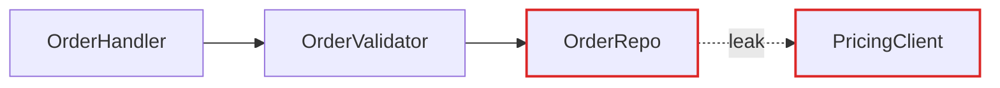
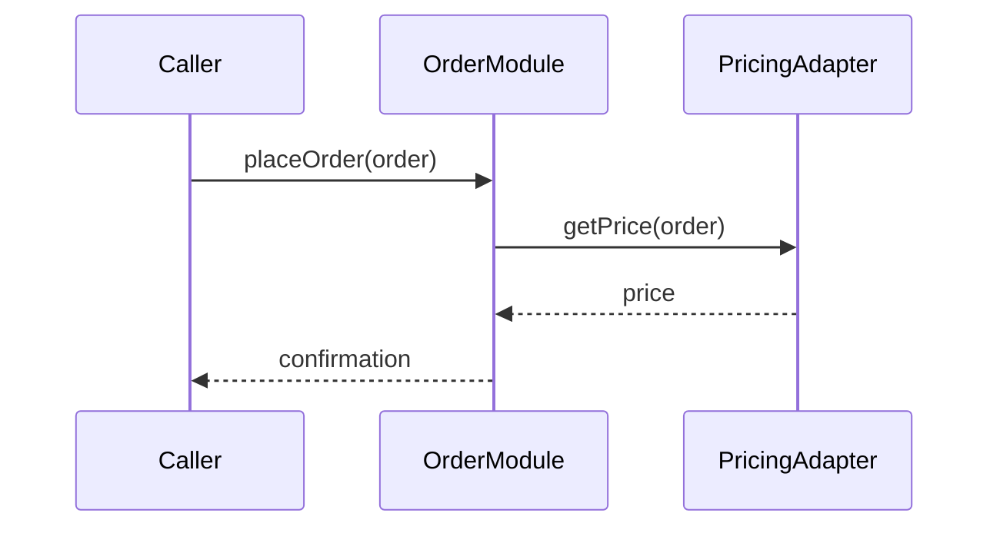
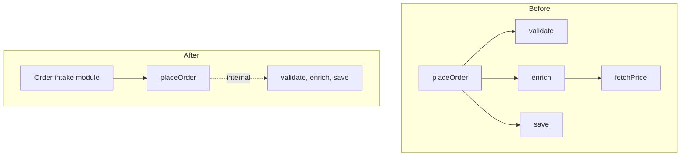

# Markdown Report Format

The architectural review is rendered as markdown output in the chat, with the option to save as `ARCHITECTURE-REVIEW.md` in the project root. No HTML, no CDN dependencies, no browser required.

Mermaid handles graph-shaped diagrams reliably; ASCII/text diagrams handle the more editorial visuals (mass diagrams, cross-sections) where Mermaid's layout fights you. Mix the two — don't lean on Mermaid for everything.

## Header

Repo name, date, and a compact legend: solid box = module, dashed line = seam, red arrow = leakage, thick dark box = deep module. No introduction paragraph — straight into the candidates.

```markdown
# Architecture review — {{repo name}}

_{{date}}_

**Legend:** `□ module` · `---> seam` · `===> leakage` · `▓ deep module`
```

## Candidate card

The diagrams carry the weight. Prose is sparse, plain, and uses the glossary terms ([LANGUAGE.md](LANGUAGE.md)) without ceremony.

Each candidate is one section:

```markdown
## {{n}}. {{title}}

**Strength:** `Strong` | **Category:** in-process

**Files:** `path/to/file.ts`, `path/to/other.ts`

### Before / After

{{diagram(s)}}

### Problem

What hurts — one sentence.

### Solution

What changes — one sentence.

### Benefits

- Tests hit one interface
- Pricing logic stops leaking
- Delete 4 shallow wrappers

### Suggested context

Domain terms worth formalising elsewhere, discovered during analysis:

- **{{term}}** — {{short definition}}. Currently used in {{files}} but not named consistently.
```

- **Title** — short, names the deepening (e.g. "Collapse the Order intake pipeline").
- **Badge row** — recommendation strength (`Strong`, `Worth exploring`, `Speculative`) and dependency category (`in-process`, `local-substitutable`, `ports & adapters`, `mock`). Render as inline code or bold labels.
- **Files** — monospaced list.
- **Before / After diagram** — the centrepiece. Two blocks, side by side or stacked. See patterns below.
- **Problem** — one sentence. What hurts.
- **Solution** — one sentence. What changes.
- **Benefits** — bullets, ≤6 words each. e.g. "Tests hit one interface", "Pricing logic stops leaking", "Delete 4 shallow wrappers".
- **Suggested context** — domain terms discovered during analysis that the project might want to formalise elsewhere.
- **ADR conflict** (if applicable) — one line in a blockquote warning.

No paragraphs of explanation. If the diagram needs a paragraph to be understood, redraw the diagram.

## Diagram patterns

Pick the pattern that fits the candidate. Mix them. Don't make every diagram look the same — variety is part of the point.

### Mermaid graph (the workhorse for dependencies / call flow)

Use a Mermaid `flowchart` or `graph` when the point is "X calls Y calls Z, and look at the mess." Sequence diagrams work well for "before: 6 round-trips; after: 1."

```markdown

```

```markdown

```

### ASCII boxes-and-arrows (when Mermaid's layout fights you)

Use plain code blocks with ASCII when you want the "after" diagram to feel like one thick-bordered deep module with greyed-out internals — Mermaid won't render that with the right weight.

```markdown
```text
Before                    After
┌──────────────┐          ┌──────────────────────┐
│ OrderHandler │          │                      │
└──────┬───────┘          │   Order intake       │
       │                  │   module             │
┌──────▼───────┐          │   ┌──────────────┐   │
│OrderValidator│          │   │ OrderHandler │   │
└──────┬───────┘          │   ├──────────────┤   │
       │                  │   │OrderValidator│   │
┌──────▼───────┐          │   ├──────────────┤   │
│   OrderRepo  │          │   │   OrderRepo  │   │
└──────────────┘          │   └──────────────┘   │
                          └──────────────────────┘
```
```

### Cross-section (good for layered shallowness)

Use horizontal ASCII bands to show layers a call passes through. Before: 6 thin layers each doing nothing. After: 1 thick band labelled with the consolidated responsibility.

```markdown
```text
Before                              After
┌────────────────────────────────┐  ┌────────────────────────────────┐
│ Validation layer (thin)        │  │                                │
├────────────────────────────────┤  │                                │
│ Transformation layer (thin)    │  │  Order intake pipeline (deep)  │
├────────────────────────────────┤  │                                │
│ Enrichment layer (thin)        │  │                                │
├────────────────────────────────┤  └────────────────────────────────┘
│ Persistence layer (thin)       │
└────────────────────────────────┘
```
```

### Mass diagram (good for "interface as wide as implementation")

Use two rectangles per module — one for interface surface area, one for implementation. Before: interface rectangle is nearly as tall as the implementation rectangle (shallow). After: interface rectangle is short, implementation rectangle is tall (deep).

```markdown
```text
Before:
┌──────────────┐
│ interface    │  tall
├──────────────┤
│              │  tall
│impl          │
└──────────────┘

After:
┌──────────────┐
│ interface    │  short
├──────────────┤
│              │
│              │  tall
│impl          │
│              │
└──────────────┘
```
```

### Call-graph collapse

Before: a tree of function calls. After: the same tree collapsed into one box, with the now-internal calls shown faded inside it.

```markdown

```

## Top recommendation section

One section. Candidate name, one sentence on why. Anchor link to its card.

```markdown
## Top recommendation

**{{candidate title}}** — tackle this first because {{reason}}.

See candidate #{{n}} above.
```

## Style guidance

- Lean editorial, not corporate-dashboard. Use headings and whitespace generously.
- Colour sparingly: Mermaid supports `classDef` for red leakage edges and dark deep modules; ASCII relies on shape and weight.
- Keep each candidate compact — the reader scrolls, so anchor links help.
- Use inline code for module labels inside diagrams — they should read as schematic, not as UI.

## Tone

Plain English, concise — but the architectural nouns and verbs come straight from [LANGUAGE.md](LANGUAGE.md). Concision is not an excuse to drift.

**Use exactly:** module, interface, implementation, depth, deep, shallow, seam, adapter, leverage, locality.

**Never substitute:** component, service, unit (for module) · API, signature (for interface) · boundary (for seam) · layer, wrapper (for module, when you mean module).

**Phrasings that fit the style:**

- "Order intake module is shallow — interface nearly matches the implementation."
- "Pricing leaks across the seam."
- "Deepen: one interface, one place to test."
- "Two adapters justify the seam: HTTP in prod, in-memory in tests."

**Benefits bullets** name the gain in glossary terms: *"locality: bugs concentrate in one module"*, *"leverage: one interface, N call sites"*, *"interface shrinks; implementation absorbs the wrappers"*. Don't write *"easier to maintain"* or *"cleaner code"* — those terms aren't in the glossary and don't earn their place.

No hedging, no throat-clearing, no "it's worth noting that…". If a sentence could be a bullet, make it a bullet. If a bullet could be cut, cut it. If a term isn't in [LANGUAGE.md](LANGUAGE.md), reach for one that is before inventing a new one.
