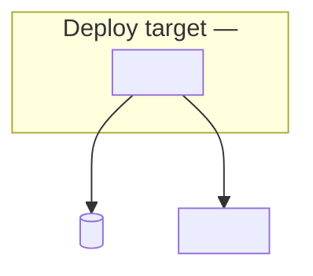

# deploy-mate — artifact templates

Copy sections into `.deploy-mate/<env>/` files. Replace placeholders; delete unused sections.

## progress.md (per environment)

Path: `.deploy-mate/<env>/progress.md` — one file per environment, not shared at repo root.

```markdown
# deploy-mate progress — <env>

Started: <date>
Status: in-progress | complete

## Phase checklist
- [ ] Recon — environment selected
- [ ] Survey — sign-off: pending | approved <date>
- [ ] Catalog — var name inventory
- [ ] Arm — tooling map (deploy + collection)
- [ ] Arm-ready — install & verify (MCP + skill + CLI) — all ready | opt-out
- [ ] Scaffold — placeholder resources staged
- [ ] Document — obtain playbooks (hard gate)
- [ ] Harvest — .env collection — in-progress | finished <date>
- [ ] Forge — strategy sign-off: pending | approved <date>
- [ ] Forge — deployment artifacts generated

## Harvest rounds
| Round | Date | Collected | Validated | Blocked | User action |
|-------|------|-----------|-----------|---------|-------------|
| 1 | | | | | |

## Re-run delta (<date>)
| Section | Status |
|---------|--------|
| architecture.md | unchanged \| updated \| new \| removed |
| configuration.md | … |
| deployment.md | … |
| generated files | … |

## Generated files
| File | Purpose | Created |
|------|---------|---------|
```

## architecture.md

```markdown
# Architecture — <env>

## Summary
<one paragraph>

## Diagram

<!-- Mandatory. Do not sign off without this section. -->

### Deploy topology



### Container view

<!-- When 3+ containers: invoke c4-diagram, link file here -->
<!-- [architecture-<env>.drawio](./architecture-<env>.drawio) -->

## Components

| Component | Role | Confidence | Evidence |
|-----------|------|------------|----------|
| <name> | <runtime role> | confirmed \| inferred \| unknown | <file:line or config path> |

## Deploy targets
| Target | Platform | Notes |
|--------|----------|-------|

## Data & external services
| Service | Purpose | Env vars (names only) |
|---------|---------|----------------------|

## Sign-off
- [ ] User approved — <date or pending>
```

## configuration.md

```markdown
# Configuration — <env>

## Tooling

### Deploy tooling

| Deploy target | MCP / skill | Notes |
|---------------|-------------|-------|
| | | |

### Collection tooling

| Source service | Vars | MCP / skill | Local CLI | Primary chain | Status |
|----------------|------|-------------|-----------|---------------|--------|
| | | | `flyctl` | cli → manual | pending \| ready \| opt-out |

## Scaffold registry

<!-- Resources created in Scaffold phase — IDs/names referenced in Document and Harvest -->

| Resource | Platform | ID / name | Created | Unblocks vars |
|----------|----------|-----------|---------|---------------|
| | | | | |

## CLI setup notes

### `<cli-name>`
- Path: `<which output>` (version)
- Auth: `<login command>` — profile/account
- Verified: `<read-only command>` → result summary

## Environment variables

<!-- One ### block per var — full template in CONFIG-GUIDE.md. Summary index: -->

| Name | Class | Deploy scope | Required | Source service | Document | Harvest |
|------|-------|--------------|----------|----------------|----------|---------|
| `VAR_NAME` | secret | deploy-critical | yes | Stripe | done | pending |
| `SLACK_BOT_TOKEN` | secret | local-dev | no | Slack | done | excluded |

---

### `VAR_NAME`

(Full per-variable block per CONFIG-GUIDE.md — include How to obtain steps, Format & validation, Deploy mapping, Harvest status)

## MCP setup notes
<install steps, config paths — or "skipped">
```

## deployment.md

Write **strategy sections first** (Forge proposal). Repo files only after Sign-off.

```markdown
# Deployment — <env>

## Prerequisites
- [ ] Document complete (obtain playbooks)
- [ ] Harvest finished — `.env` complete (deploy blocked until done)

## Proposed strategy

<!-- Forge proposal — draft and revise with user before any repo file generation -->

### Platform & runtime
<target platform, region, scaling notes>

### CI/CD flow
<trigger → build → test → deploy stages; branch/tag policy>

### Build & containers
<Dockerfile vs buildpack, multi-stage, compose if local>

### Env injection
<how `.env` vars reach runtime — platform secrets, GitHub Actions, …>

### Rollback
<how to revert a bad deploy>

### Optional scope
- Observability: … | deferred
- DNS: … | deferred
- Migrations: … | deferred

## Sign-off
- [ ] User approved strategy — <date or pending>
- Open questions resolved: …

## Steps
<!-- Fill after sign-off -->
1. …

## Generated files
<!-- Fill after sign-off — list every repo file created -->
| File | Purpose |
|------|---------|

## Env var references
Names only — values in `.deploy-mate/<env>/.env`:
- `VAR_NAME` — used by …
```

## .env (gitignore)

```bash
# .deploy-mate/<env>/.env — chmod 600, never commit
# KEY=value
```

Add to project `.gitignore` if missing:

```
.deploy-mate/**/.env
```


